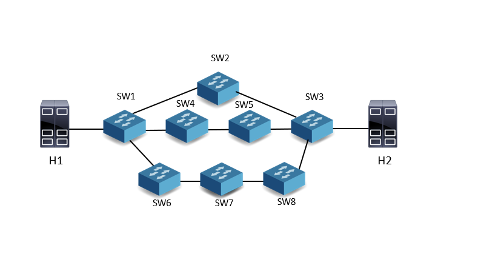

Mininet Scripts
===============

:Version: Mininet 2.3.0

The installation instructions for mininet can be found here_. 

**Note:** I installed mininet from the source github.

.. _here: http://mininet.org/download/#option-2-native-installation-from-source

Generate Network Metrics
========================

The generate_metrics.py_ script is used to generate and save link bandwidth, delay, and packet loss metrics. There is a CSV file created
for each path in the network (for example_). Currently this script can only generate metrics for the topology in three_paths_topo.py_.
The scipt will generate a set of metrics for each of the three paths for the desired number of simulations (edit the num_simulations parameter 
to adjust the number of simulations). 

.. _generate_metrics.py: https://github.com/adam-durning/ryu/blob/development_branch/ryu/app/qoe_app/mininet/generate_metrics.py
.. _example: https://github.com/adam-durning/ryu/blob/development_branch/ryu/app/qoe_app/topo_info/2link_topoinfo.csv
.. _three_paths_topo.py: https://github.com/adam-durning/ryu/blob/development_branch/ryu/app/qoe_app/mininet/three_path_topo.py
.. _topo_info: https://github.com/adam-durning/ryu/blob/development_branch/ryu/app/qoe_app/topo_info/

Topology Script
===============
The script three_paths_topo.py_ is a mininet script that generates the topology shown below. The metrics are read from the csv files generated by generate_metrics.py_;
these files are located in the topo_info_ directory.

